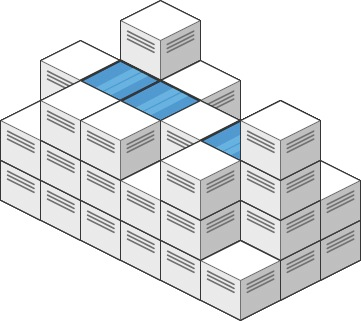

[Trapping Rain Water II](https://leetcode.com/problems/trapping-rain-water-ii/description/)
===

Given an `m x n` integer matrix heightMap representing the height of each unit cell in a 2D elevation map, return _the
volume of water it can trap after raining_.

**Example 1:**


```text
Input: heightMap = [[1,4,3,1,3,2],[3,2,1,3,2,4],[2,3,3,2,3,1]]
Output: 4

Explanation:
After the rain, water is trapped between the blocks. 
We have two small pounds 1 and 3 units of water trapped. 
The total volume of water = 4 units.
```

**Example 2:**


```text
Input: heightMap = [[3,3,3,3,3],[3,2,2,2,3],[3,2,1,2,3],[3,2,2,2,3],[3,3,3,3,3]]
Output: 10
```

**Constraints**:

* `m == heightMap.length`
* `n == heightMap[i].length`
* `1 <= m, n <= 200`
* `0 <= heightMap[i][j] <= 2 * 1e4`